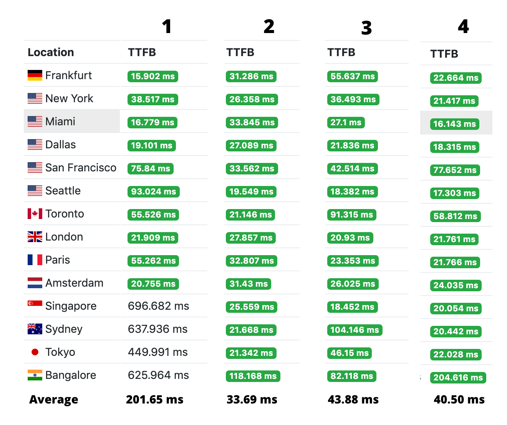

Most third party libraries shares CDN (Content Delivery Network) links on their website but generally many CDN's offers the same library and you might end up using a poor CDN which can effect your page load speed and can add a big security risk to your website. This tutorial is about choosing a right CDN for any 3rd party library, be it CSS framework or JS library. Here are a few best practices: 

## Performance of the CDN
The performance of the CDN can decide how fast the content could be delivered on the user's browser. Technically, this is related to [TTFB](https://en.wikipedia.org/wiki/Time_to_first_byte) (Time to First Byte) which defines the time between a browser makes a request for the resource and a first byte is received as response. So, TTFB is something which is totally dependent on the CDN network and impacts your page speed. 

Let's take an example of a most commonly used library, **jQuery**, which is available on multiple CDNs. Let's check the performance of the various CDNs across different regions over the globe, using [KeyCDN](https://tools.keycdn.com/performance) performance tool.

1. [code.jquery.com](https://code.jquery.com/jquery-3.4.1.min.js) - Official
2. [cdnjs.com](https://cdnjs.cloudflare.com/ajax/libs/jquery/3.4.1/jquery.min.js) - By Cloudflare
3. [ajax.googleapis.com](https://ajax.googleapis.com/ajax/libs/jquery/3.4.1/jquery.min.js) - By Google
4. [jsdelivr.net](https://cdn.jsdelivr.net/npm/jquery@3.4.1/dist/jquery.min.js) - By ProspectOne



You can see that the CDN link shared on **jQuery** official website is performing around 75% slower than other CDNs if all regions have equal importance for you. Cloudflare CDN, cdnjs.com is performing way better than others.

## Security of resource

Public CDNs deliver JS and CSS resources on your website and there is a risk of those CDN to get hacked and vulnerable code is delivered on your website. In order to prevent this, you must use **integrity** attribute on link and script tags. Integrity attribute enables checksum for the code that is delivered and that code is executed only if the cryptographic hash mentioned matches with the code received. Learn how to [add integrity attribute](https://developer.mozilla.org/en-US/docs/Web/Security/Subresource_Integrity#Using_Subresource_Integrity). 

e.g.
```html
<script src="https://cdnjs.cloudflare.com/ajax/libs/jquery/3.4.1/jquery.min.js" integrity="sha384-vk5WoKIaW/vJyUAd9n/wmopsmNhiy+L2Z+SBxGYnUkunIxVxAv/UtMOhba/xskxh"   		crossorigin="anonymous"></link>
```

```html
<link href="https://stackpath.bootstrapcdn.com/font-awesome/4.7.0/css/font-awesome.min.css" integrity="sha384-vk5WoKIaW/vJyUAd9n/wmopsmNhiy+L2Z+SBxGYnUkunIxVxAv/UtMOhba/xskxh"
        crossorigin="anonymous"></script>
```


## Uptime
Uptime is also an important aspect for choosing the CDN, generally CDN's website shares the uptime reports or you can use [cdnperf.com](https://www.cdnperf.com/#!rum) to check the uptime status of various CDNs. 

## Cache & Protocol
While selecting a CDN, you should choose a CDN with a good range of cache time range as the libraries are delivered version based and content is static. Even though browser handles the cache itself but its a good practice if CDN is sending Cache related headers in response. 

Similarly, HTTP/2 protocol CDN can compress the request headers and reduces the round trip time(RTT) in optimized manner than HTTP/1 protocol. Learn more [about it.](https://www.keycdn.com/blog/http2-cdn)

You can see the response headers of the request using below command in terminal.
```sh
curl -I https://code.jquery.com/jquery-3.4.1.min.js
```
