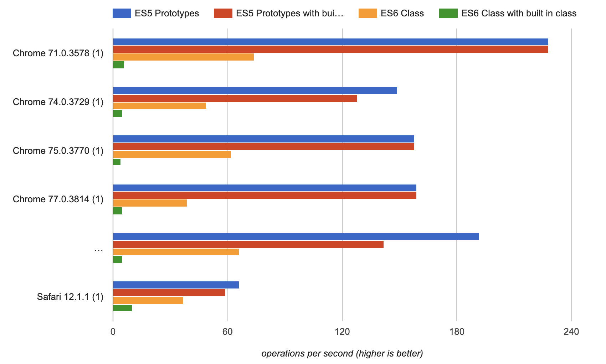

While reading about the new features rolled out in ES6(2015), you will come across a word, **"Class"**, that has quite similar functionality as the previous Object Oriented languages such as Java, Python has. Some of the ES6 features, like the introduction of **let and const**, improved the way to declare variables, but the introduction of the **map, filters** over array just improved the code readability only. Similarly, the concept of Class was there in ES5 also, but it is difficult to implement class in ES5. 

This article is about the performance of one of the functionalities of Class, i.e. extends, which lets you inherit properties from its parent class. You can read more about Class's **extends** functionality [here](https://scotch.io/tutorials/demystifying-es6-classes-and-prototypal-inheritance#toc-subclassing-in-es6) and how it has been handled in ES5 with **Object.create**, [here](https://medium.com/@dange.laxmikant/simplified-inheritance-in-js-es5-way-60b4ff19b008).

There could be multiple ways for comparison, but for now, let's take a few very basic examples of inheritance's performance comparison where: 
1. The parent class and child class are custom ES6 classes and ES5 methods.
2. The parent class is a built-in Class(Date, Number, etc.) and child class is custom Class and method.

```js
/* --------------------------
 * Snippet 1
 * Custom parent and child ES6 classes and using extends
 * ----------------------------*/
function testClass(N){
  class Parent{};
  class X extends Parent {}
  for(var i=0; i<N;i++){
    new X();
  }
}
testClass(1e6);

/* --------------------------
 * Snippet 2
 * Custom parent and child ES5 methods and using Object.create 
 * for inheritance
 * ----------------------------*/
function testPrototypes(N){
  function Parent(){}
  function X(){}
  X.prototype = Object.create(Parent.prototype);
  for(var i=0; i<N;i++){
    new X();
  }
}
testPrototypes(1e6);

/* --------------------------
 * Snippet 3
 * Built-in parent class and custom ES6 class using extends
 * ----------------------------*/
function testClass(N){
  class X extends Date{};
  for(var i=0; i<N;i++){
    new X();
  }
}
testClass(1e6);

/* --------------------------
 * Snippet 4
 * Built-in parent class and custom child method using Object.create
 * ---------------------------- */
function testPrototypes(N){
  function X(){}
  X.prototype = Object.create(Date.prototype);
  for(var i=0; i<N;i++){
    new X();
  }
}
testPrototypes(1e6);

```
<br>
So we have four snippets as: 

**Snippet 1**: Both parent and child are **custom ES6 classes** and using `extends` property for inheritance.

**Snippet 2**: ES5 way of creating inheritance where Person is a **custom parent method and the child method**, X method is inheriting the properties of the parent with Object.create.

**Snippet 3**: Using a built-in class, `Date`, as a parent and class X is inheriting parent properties with ES6 extends. 

**Snippet 4**: Using a built-in class, `Date`, as a parent and method X as a child.

## Result
I am using [jsperf.com](https://jsperf.com) for running the performance test of above snippets. You can refer to it [here](https://jsperf.com/es6-class-vs-es5-proto/) for the below findings:
 


1. For custom parent and custom child, ES6 extends(orange) is doing **66.88 ops/sec** while ES5 Object.create(violet) can do **195 ops/sec**.
2. For the built-in class as a parent, ES6 extends(green) is doing **6.12 ops/sec** while ES5 Object.create(red) is doing **151 ops/sec**. 

So, the performance difference is quite huge when built-in class functionality is extending. I will definitely add more cases here. 
