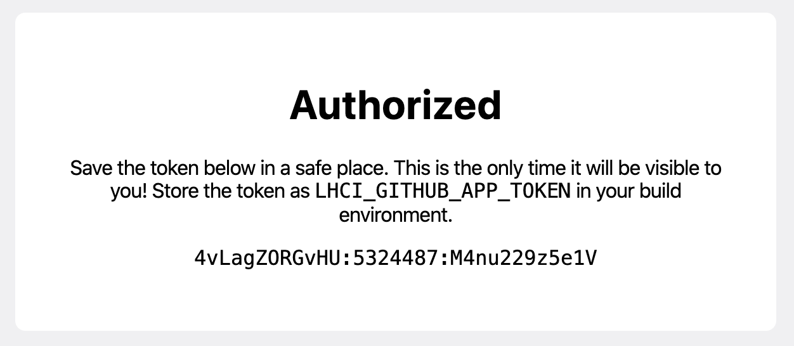
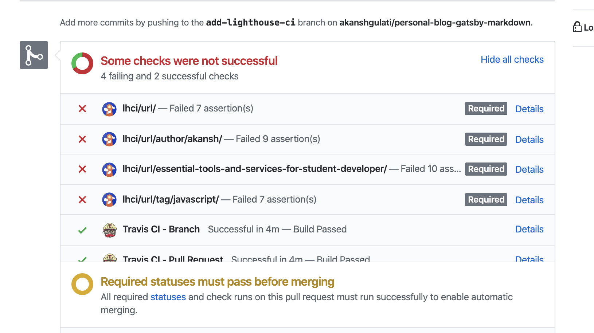

Performance and accessibility have become two important factors for improving SEO and content readability for a website. Currently, Lighthouse is available as `Audit` section in Chrome developer tools which requires manual effort to run, validate assertions with results and deciding whether the current score is good enough for production. All these problems are covered with [Lighthouse CI](https://github.com/GoogleChrome/lighthouse-ci) which automatically runs the test when you open a PR(Pull Request), commit on a branch, push a new branch, etc. and validates the score as per your expectation.

I explicitly mentioned static site generator because configuration files mentioned below are meant for frameworks such as Gatsby, Hugo, Jekyll, etc. which generates the entire website in a directory and an Http server is all that is required. 

### Important terms

 - Assertions - Various rules which user set as per webpage, e.g. first
   meaning paint should be less than 1500ms or else throw error/warning.
 - Travis CI - A helper which builds your website, run Lighthouse for
   auditing and shares result back to Github, Gitlab etc.
 - Viewing score - Lighthouse is showing results as a webpage stored on
   their servers, you can change this setting once basic versions   
   work properly.
   
### Prerequisites:

1.  [Travis CI](https://travis-ci.com) account
2.  Having source code managed with git e.g. Github, Gitlab, etc.
3.  A static site generator such as Gatsby, Jekyll, Hugo, etc.

 
**Note:** 
*Below tutorial is based for setting Lighthouse on a blog only having certain types of pages, such as home page, author page having all
posts, tag page having all tag related posts and a post webpage just like the one you are reading.*


## Demo
- Travis build with Lighthouse CI - [link](https://travis-ci.com/akanshgulati/personal-blog-gatsby-markdown/builds/137460353)
- Lighthouse CI Github status - [link](https://storage.googleapis.com/lighthouse-infrastructure.appspot.com/reports/1574369668468-50602.report.html)

## Steps:

#### 1.  Create `.travis.yml` file

Create file at the top level of the project and add below configuration.

  ```yaml
  language: node_js # Node 10 LTS or later required  
node_js:  
 - '10'  
addons:  
  chrome: stable # make Chrome available  
before_install:  
 - npm install -g @lhci/cli@0.3.x # install LHCI (Lighthouse CI)  
script:  
 - yarn run build # command in package.json to build your site  
after_success:  
 - npx http-server -s -p 8080 ./public &
  - lhci healthcheck --fatal  
  - lhci autorun # run lighthouse CI against your static site
  ```

Make sure the command you use for building production-ready code is added under the `script` section above, generally it’s `yarn run build`.

  

#### 2. Create `lighthouserc.json` file

Create file at the top level of the project and add below JSON configuration.

```json
{
  "ci": {
    "collect": {
      "url": [
        "<CHANGE URL>http://localhost:8080/",
        "<CHANGE URL>http://localhost:8080/tag/javascript",
        "<CHANGE URL>http://localhost:8080/author/akansh",
        "<CHANGE URL>http://localhost:8080/essential-tools-and-services-for-student-developer/"
      ],
      "numberOfRuns": 2
    },
    "assert": {
      "preset": "lighthouse:recommended",
      "assertions": {
        "first-contentful-paint": [
          "error",
          {
            "maxNumericValue": 2500,
            "aggregationMethod": "optimistic"
          }
        ],
        "interactive": [
          "error",
          {
            "maxNumericValue": 5000,
            "aggregationMethod": "optimistic"
          }
        ],
        "uses-text-compression": "off",
        "uses-long-cache-ttl": "off",
        "uses-http2": "off"
      }
    },
    "upload": {
      "target": "temporary-public-storage"
    }
  }
}
```
<br/>
<br/>
In this configuration we are setting three things:

1. **Collect**: Used to defines the URLs and other audit configurations.
    - *urls*: different types of pages to run tests on, e.g.
        1. Home page - `/`
        2. Author page - `/author/akanshgulati`
        3. Tag page - `/tag/javascript`
        4. Post page - `/essential-tools-and-services-for-student-developer/`
    - numberOfRuns - number of times to run an audit for each URL for generic results (impacts your total test time)

2. **Assertions**: You can use industry set rules a.k.a `presets` such as “lighthouse:all”, “lighthouse:no-pwa” or define each rule. You need to turn **“off”** a few rules (e.g. uses-http2) which cannot be checked on local Http server we are setting up on Travis CI. Read more about [presets](https://github.com/GoogleChrome/lighthouse-ci/blob/master/docs/assertions.md#presets), [custom rules](https://github.com/GoogleChrome/lighthouse/blob/v5.5.0/lighthouse-core/config/default-config.js#L375-L407) and assertions [here](https://github.com/GoogleChrome/lighthouse-ci/blob/master/docs/assertions.md).
3.  **Upload**: Used to define where result web pages are to be uploaded. Currently, we are temporarily storing it on Google servers. Read more about upload [here](https://github.com/GoogleChrome/lighthouse-ci/blob/master/docs/getting-started.md#the-lighthouse-ci-server).

  

#### 3. Authorise Lighthouse with Github
1. Open [Lighthouse CI App link](https://github.com/apps/lighthouse-ci)
2. Authorise (Need organisation admin access to add to organisation repo)
3. Copy the `LHCI_GITHUB_APP_TOKEN` token on Authorisation page



**Note:** This token needs to be added to your build environment (e.g. Travis, Jenkins, Circle CI, etc.)

#### 4. Authorise Travis CI with Github

1. Open [Travis CI repository dashboard](https://travis-ci.com/account/repositories) and check if you can see repository under `Github Apps Integration` section. Otherwise, use `Manage repositories on Github` to add it.
2. Open the repository settings and paste the`LHCI_GITHUB_APP_TOKEN` key and value in “Environment Variables” section.



#### Final step 
- Test by creating a PR in the repository and check if following screen is coming.
- If tests are failing, you can check the Lighthouse assertions which are failing in **Travis CI** build console, either make improvements or change failing rule strictness(error, warn, off) in assertions section of `lighthouserc.json` file. 

## Troubleshooting
- You can comment your issues below with repository link and branch name.
- Lighthouse CI has provided various FAQs for reducing the chances of error, access it [here](https://github.com/GoogleChrome/lighthouse-ci/blob/master/docs/troubleshooting.md).  

## Extra
- [Lighthouse JSON Viewer](https://googlechrome.github.io/lighthouse/viewer/ ) - View report of Lighthouse from JSON
- Disable Merge on assertion fail - You can setup rules in repository settings for **branch** and make Lighthouse builds mandatory before merge. 
