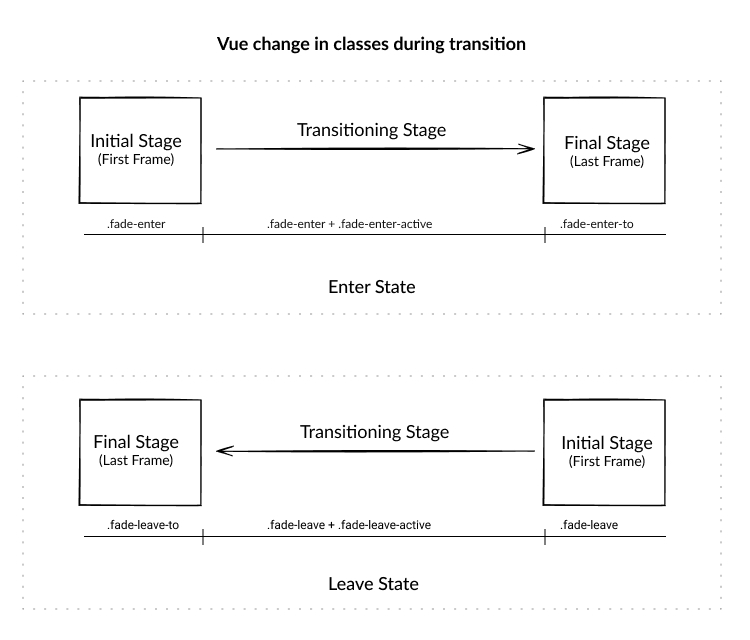
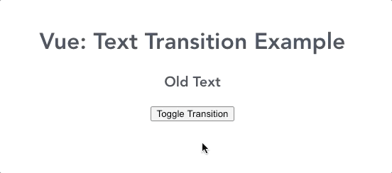
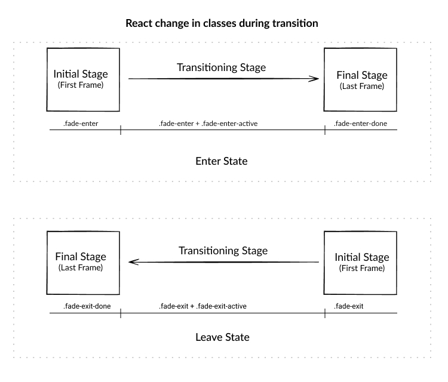

Text transitions are usually preferred when you need to notify a user of any text 
being changed on screen and it just not make the experience better, but, also 
important when text content on website changes based on the user actions on the screen.

> For example, if you're on an e-commerce website and read the price of
> an item, but, you changed the quantity of the item and suddenly your
> shipping charges are increased, making it important to highlight those
> changes to the user.

I believe this is one of the use-cases where text transitions are required, 
also, React and Vue frameworks support Hot Module Replacement, updating only the 
particular modules. See the example below to understand how simple text transition can 
have an impact on user experience. 

For example: 

You can observe the difference when the UI has no transition, we might have missed the change in the heading at first look. 

Before we start with any framework, the following things are common among various frameworks for transitions in entering and leaving transition states:

### Transition Stages

There are three stages in each state of transitioning, initial stage, transitioning stage and transition done stage, 
giving us total 3+3 stages for entering and leaving altogether. The naming convention may vary with a different framework, 
see in below image for better understanding.

</img>
 
### Transition Triggers
To trigger the transition, there are multiple ways, a few of them are as followed:
1. Adding/Removing a node from the DOM tree
2. Showing and hiding a node from UI (using display: none)
3. Adding/Removing items into the list
4. Dynamically updating the current node with a new node

For **text replace** transition, we will be using Dynamic node updating criteria where a new node/text content 
takes place of the old node/text content. 
 
Let's see how it can be implemented and understand the complexity with different frameworks.

## Vue JS Implementation

Vue has in-built `<Transition>` wrapper component which allows adding entering and leaving transitions for a component 
or a parent node wrapping multiple nodes. Refer below image for different classes available. 

We will use Dynamic Component loading, mentioned above as one of the Transition triggers, for text change transition 
using `key` attribute to inform Vue of any change in node/content. 

Once we implement this, we see transitioning working as below: 

</img>

You can see that this is **NOT** what we desire, the problem is that the new text content is coming before the previous 
text content is hidden and due to this, both contents are visible for a fraction of second during transitioning.
This is what we call as `in-out` mode, which is set by default.

**How to solve this flickering issue?**

To make this transition smooth, we have to make sure that the transition of old text content is completed 
before new content transition starts. For that, we specify mode as `out-in` to prevent flickering. 
You can read more about transitions and modes in-depth [here](https://vuejs.org/v2/guide/transitions.html).

<iframe src="https://codesandbox.io/embed/vue-text-transition-example-nlvog?fontsize=14&hidenavigation=1&theme=dark"
     style="width:100%; height:500px; border:0; border-radius: 4px; overflow:hidden;"
     title="Vue: Text Transition Example"
     allow="accelerometer; ambient-light-sensor; camera; encrypted-media; geolocation; gyroscope; hid; microphone; midi; payment; usb; vr; xr-spatial-tracking"
     sandbox="allow-forms allow-modals allow-popups allow-presentation allow-same-origin allow-scripts"
   ></iframe>

 

##  React Implementation

Unlike Vue, in React, we have to import a separate transition library, [react-transition-group](https://reactcommunity.org/react-transition-group/)
 which provides specific Component wrappers like CSSTransition, Transition, SwitchTransition and TransitionGroup. 

For text replace specifically, we need two components, `CSSTransition` and `SwitchTransition`. It also has 3 stages of 
the text transition in both entering and leaving transition states just live Vue. Refer to below diagram to understand the classes.

### CSSTransition 
It handles the transition on the content, like the timeout, transition class name, etc., It has support for following props: 

1. **Timeout**: You can define the timeout of the entering and leaving transition separately or as a common numeric time in milliseconds. 
2. **addEndListener**: You can define the method here for ending the transition. 
3. **ClassNames**: The name has been set as plural (with s), just to not mix it with React default way of adding CSS classes 
 on any node using className. This lets you define the parent class which will be used to define the transition. 
4. **In**: This prop lets you state when the transition classes are to be applied on the node/text content. It's a sort 
 of switch to turn on and off transition effects dynamically on DOM.  Vue's `<Transiton>` component has 
 no direct prop or method to trigger such functionality. You can read more about its various options [here](http://reactcommunity.org/react-transition-group/css-transition).

### SwitchTransition 
Similar to Vue, we need to specifically select the `out-in` mode for letting the old content be taken out of DOM before new 
content comes. For that, we need to use this separate component. You can read more about its various options [here](http://reactcommunity.org/react-transition-group/switch-transition)

<iframe
     src="https://codesandbox.io/embed/react-text-replace-transition-cz08h?fontsize=14&hidenavigation=1&theme=dark"
     style="width:100%; height:500px; border:0; border-radius: 4px; overflow:hidden;"
     title="React: Text Replace Transition"
     allow="accelerometer; ambient-light-sensor; camera; encrypted-media; geolocation; gyroscope; hid; microphone; midi; payment; usb; vr; xr-spatial-tracking"
     sandbox="allow-forms allow-modals allow-popups allow-presentation allow-same-origin allow-scripts"
   ></iframe>

 

## Vanilla JS Implementation

We are removing and adding the same `fade` class with changed text content and using innerHTML method which repaints
 the content showing the animation. 

> By default, we add a fade out related properties to `.text` class so
> that once the `fade` class is removed, it can work just like
> `fade-leave-active` in Vue or `fade-exit-active` in React.

There are two methods by which you can add transition: 
1. **Timeout Centric**: In this, you have to manually mention the timeout of the leaving 
state of the transition. This is not a recommended way, because same time needs to be 
entered in CSS styles. The timeout part is being handled with the `setTimeout` method and `requestAnimationFrame` 
callback to prevent any [jank-like](https://googlechrome.github.io/devtools-samples/jank/) (drop in frame rate) experience. 

2. **CSS Centric**: Here we leverage `transitionend` JS event listener which updates when the one state of transition is over serving the purpose of timeout being used above. 

<iframe
     src="https://codesandbox.io/embed/vanilla-js-text-transition-example-hc7kq?fontsize=14&hidenavigation=1&theme=dark&view=preview"
     style="width:100%; height:500px; border:0; border-radius: 4px; overflow:hidden;"
     title="Vanilla JS : Text Transition Example"
     allow="accelerometer; ambient-light-sensor; camera; encrypted-media; geolocation; gyroscope; hid; microphone; midi; payment; usb; vr; xr-spatial-tracking"
     sandbox="allow-forms allow-modals allow-popups allow-presentation allow-same-origin allow-scripts"
   ></iframe>

 
Hope you got some basic idea about how implementation is different as per framework and in vanilla JS. 
